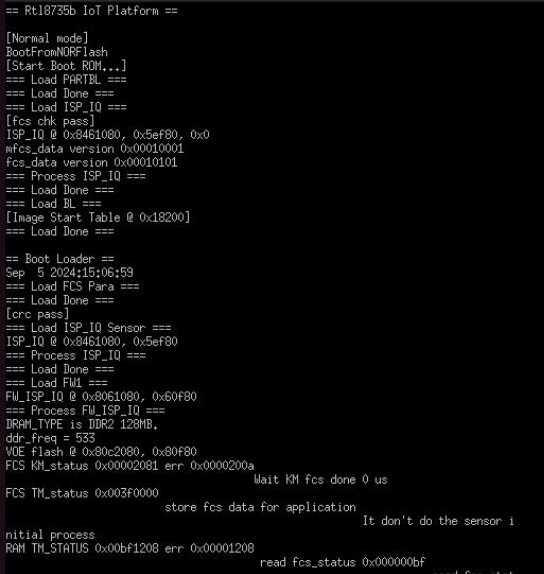
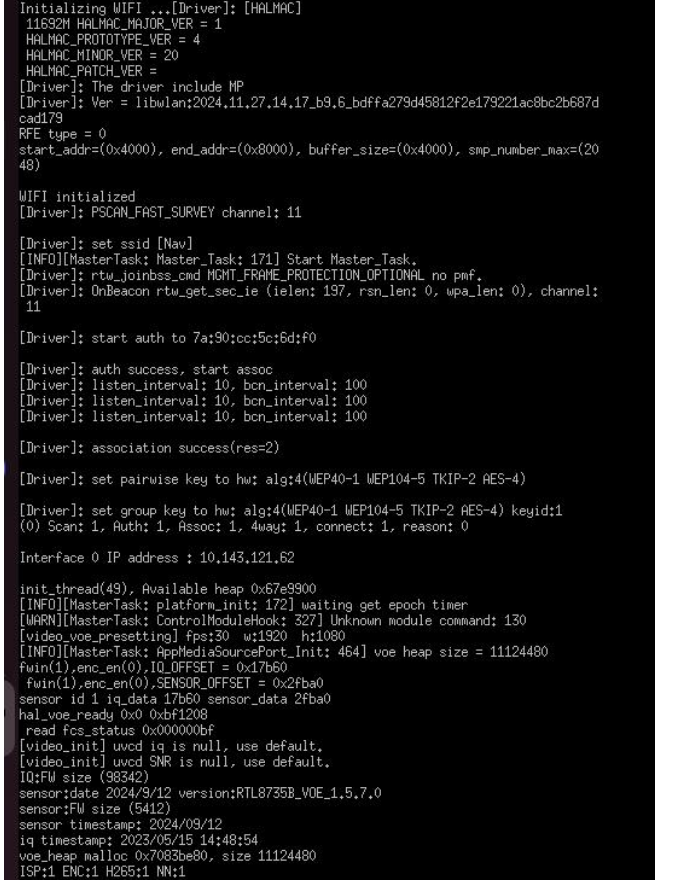

# CrowdSentinel — AI-IoT Stampede Risk Prediction

CrowdSentinel is a real-time crowd density monitoring and risk prediction system. Detection runs **on the camera board itself** — a Realtek Ameba Pro 2 executes the neural network on its NPU — and the video plus the per-frame detection metadata reach the host over a single AWS KVS **WebRTC** connection, which drives visual/audible alerts for potential stampede scenarios.


## ◈ Core Features

- **On-Device AI Detection**: The Ameba Pro 2 runs the detector on its NPU and emits every inference as JSON on the WebRTC data channel, so the host never has to re-detect what the board already saw.
- **Low-Latency Feed**: Peer-to-peer H.264 over AWS KVS WebRTC, no intermediate restream.
- **Crowd-Pressure Risk Engine**: The alarm is on crowd **pressure**, not headcount —
  `P = density x fps² x Var(velocity)`, in s⁻². Headcount enters only through the density term and
  is multiplied by velocity variance, so 200 people standing still is normal while 15 shoving in a
  doorway is critical. Thresholds (s⁻²) are ELEVATED 0.010 / HIGH 0.020 / CRITICAL 0.040 on the
  way up, with hysteresis fall values 0.008 / 0.016 / 0.032; the 0.020 figure follows
  Helbing/Johansson's crowd-turbulence onset.
- **In-Process Analytics**: The dashboard runs the SF-CPI pipeline itself — one WebRTC session
  feeds both the video panel and the risk computation, and alerts (log, optional AWS SNS) come out
  of a state machine with dwell and re-alert gating, not out of the browser.
- **Tactical Dashboard**: A high-contrast, industrial dashboard with real-time stats including:
  - **Live Count**: Person count straight from the board's NPU inference.
  - **Stampede Risk Gauge**: The server's risk level and pressure, rendered — not recomputed.
  - **Crowd Density Gauge**: Visual representation of density across the monitored area.
  - **Timeline Chart**: Historic traffic analysis using Chart.js.

## ◈ Hardware & Edge Device

Crowdsentinel is designed to work with resource-constrained IoT edge devices. The system utilizes the **Realtek Ameba Pro 2 (RTL8735B)** development board integrated with a high-resolution camera module.



- **SoC**: ARM Cortex-M (ARMv8M) up to 300 MHz
- **Memory**: 32–64 MB LPDDR RAM
- **Connectivity**: Dual-band Wi-Fi (802.11ac/n)
- **Multimedia**: Hardware H.264/H.265 video codec & ISP for 5 MP camera input
- **OS**: Amazon FreeRTOS (LTS) for multitasking and secure networking

Real-time video is captured, encoded in H.264, and broadcast using the **Amazon KVS WebRTC C SDK**, allowing for secure, low-latency, peer-to-peer media transmission. The same peer connection carries a data channel on which the firmware publishes each NPU inference as a compact JSON message (`{"t":…,"w":…,"h":…,"model":…,"d":[[x,y,w,h,conf]…],"n":…,"trunc":…}`); `n` is the authoritative person count, since the box array is capped by the firmware.

## ◈ Firmware Flashing (`Pro2_PG_tool`)

To flash the firmware onto the Ameba Pro 2, use `flash/Pro2_PG_tool_v1.4.3`.

1.  **Connect Device**: Connect the board to your PC via a USB Micro-B cable.
2.  **Select Tool**:
    - **Windows**: Run `flash/Pro2_PG_tool_v1.4.3/uartfwburn.exe`.
    - **Linux**: Run `flash/Pro2_PG_tool_v1.4.3/uartfwburn.linux`.
3.  **Configure Settings**:
    - Select the correct COM/Serial port.
    - Set the download baud rate to **2000000** (115200 is only the console/handshake rate).
4.  **Flash**: Use `flash_ntz.nn.bin` (application **and** NN model partition):
    ```bash
    ./uartfwburn.linux -p /dev/ttyUSB0 -f flash_ntz.nn.bin -b 2000000 -U -r
    ```
    Enter program mode first: hold Reset, press Program, release Reset, release Program.

## ◈ AWS Kinesis Video Streams (KVS) WebRTC Setup

The system leverages AWS KVS to negotiate WebRTC connectivity and SDP/ICE signaling between the device (Master) and multiple viewers.

1.  **Create Signaling Channel**: Set up a KVS Signaling Channel in the AWS Console and note its ARN.
2.  **Link Channel to Video Stream**: Link the signaling channel to the video stream to ensure WebRTC ingestion is routed correctly.
3.  **IAM Configuration**: Create an IAM policy allowing the edge device to perform KVS Actions (`DescribeSignalingChannel`, `GetSignalingChannelEndpoint`, etc.).
4.  **Firmware Credentials**: Configure the following in your firmware:
    - `AWS_REGION`
    - `AWS_ACCESS_KEY_ID` & `AWS_SECRET_KEY`
    - `AWS_KVS_CHANNEL_NAME`

## ◈ System Diagnostics & Monitoring

- **Serial Console**: Upon powering the device, monitor progress via the serial console (115200 baud). Success is indicated by logs showing "WIFI initialized," "Signaling Channel Described," and successful WebRTC Master task startup.



- **Media Playback Viewer**: The Kinesis Video Streams console provides a live viewer to verify stream ingestion (typically 1280×720 @ 30 FPS, ~1000 kbps).

- **Viewer slots**: the board accepts only **two** concurrent viewers (`AWS_MAX_VIEWER_NUM`), and reclaims a stale session only after a 30 s inactivity timeout. If the dashboard and the AWS console viewer are both attached, a third client such as `sfcpi live` will time out during ICE/media negotiation — close one, or wait for the board to reclaim the slot.

## ◈ Known Limitations (open, not solved)

- **OSD boxes contaminate the analytics.** The firmware burns its detection rectangles into the same H.264 stream the host computes optical flow from, so the boxes inject motion the crowd did not make into `Var(v)` and therefore into the pressure figure. The fix is to keep the NN overlay off the frames used for flow; not done.
- **Partial frame coverage.** Optical flow cannot keep up with 30 FPS at 1280×704, so the host drops a large fraction of frames (observed on live runs: roughly 450–750 dropped per few hundred processed). Correctness is protected — the pipeline scales each frame pair by its own measured interval rather than the nominal FPS — but a burst shorter than the gap between two processed frames is not seen.

## ◈ Tech Stack

- **Backend**: Python 3, Flask, OpenCV, `aiortc`/`botocore` (KVS WebRTC ingest in `src/sfcpi/webrtc/`)
- **AI Engine**: on-device SCRFD on the Ameba Pro 2 NPU; Ultralytics YOLO26 for the host-side training/conversion pipeline in `models/`
- **Analytics**: SF-CPI — Farnebäck optical flow over a cell grid, crowd pressure in s⁻², hysteresis thresholding and a dwell/re-alert state machine (`src/sfcpi/`)
- **Frontend**: Vanilla HTML5/CSS3 (Cyberpunk/Tactical theme), JavaScript (ES6+), SSE (Server-Sent Events)
- **Visualization**: Chart.js

## ◈ File Usage & Roles

The project follows a modular structure to separate logic from presentation:

-   **`src/dashboard/server.py` (Backend)**: The brain of the application. It ingests the live KVS WebRTC stream, takes the person count from the board's data-channel metadata, and runs the SF-CPI pipeline on the same frames — optical flow, crowd pressure, the `RiskStateMachine`, and alert publication (log sink always; AWS SNS only when `SNS_TOPIC_ARN` is set **and** `SNS_ENABLE=1`, and dry-run unless `SNS_DRY_RUN=0`). It exposes the result over REST/SSE for the frontend.
-   **`src/sfcpi/` (Pipeline)**: The analytics package the dashboard and the `sfcpi` CLI share — `webrtc/` (KVS signalling, SigV4, the frame bridge, data-channel metadata), `flow.py`/`grid.py`/`metrics/pressure.py` (motion → pressure), `risk/` (thresholds, hysteresis, state machine) and `alerts/`.
-   **`src/dashboard/templates/index.html` (Structure)**: The skeleton of the dashboard. It uses Jinja2 templates to dynamically load assets and provides the layout for the live feed and stats panels.
-   **`src/dashboard/static/style.css` (Aesthetics)**: Contains the "Military Tactical" design system. It manages the dark-mode theme, scanline animations, and responsive grid layouts.
-   **`src/dashboard/static/main.js` (Logic)**: The frontend controller. It manages:
    -   **SSE Connection**: Constantly listens to `/count_feed`, which carries the person count *and* the server's `pressure`, `max_pressure`, `level`, `coverage` and last alert.
    -   **State Management**: Renders the risk level the server decided — it does **not** compute risk. The old `calcRisk(count)` headcount heuristic is gone; `CROWD_THRESHOLD` survives only as a display scale for the count bar and the chart's reference line.
    -   **API Interaction**: Controls the starting/stopping of the live stream via fetch requests.

## ◈ Folder Structure

```bash
Yan/
├── flash/                  # device tooling + flashable images
│   └── Pro2_PG_tool_v1.4.3/    # uartfwburn + flash_ntz.nn.bin
├── src/                    # all source
│   ├── firmware_webrtc/        # KVS WebRTC firmware (AmebaPro2) + vendored SDK
│   ├── sfcpi/                  # host pipeline: WebRTC ingest, board metadata, risk/alerts, CLI
│   ├── dashboard/              # Flask app: server.py, static/, templates/
│   └── images/                 # screenshots used by this README
├── tests/                  # pytest suite for src/sfcpi
└── models/                 # weights, dataset, conversion
    ├── weights/                # best.pt + ONNX exports
    ├── dataset/                # Roboflow crowd-density dataset + train.py
    ├── conversion/             # .pt -> ONNX -> .nb scripts
    └── acuity/                 # Acuity/pegasus toolkit + calibration workspace
```

## ◈ Quick Start

1. **Install Dependencies**: the host package uses a `src/` layout, so install it from the repository root.
   ```bash
   python3 -m pip install -e .
   pip install flask opencv-python numpy python-dotenv
   # live KVS WebRTC ingest additionally needs (not declared in pyproject.toml):
   pip install aiortc websockets boto3
   ```

2. **Configure AWS credentials**: picked up from the standard AWS environment (or a shared
   profile / instance role) by `boto3`. See `src/sfcpi/webrtc/README.md` for the IAM actions the
   viewer identity needs. The channel and region come from the environment too, and the CLI and
   the dashboard read the same names so they cannot be aimed at different boards:
   ```env
   AWS_ACCESS_KEY_ID=...
   AWS_SECRET_ACCESS_KEY=...
   KVS_CHANNEL_NAME=camstream       # default: camstream
   AWS_REGION=ap-south-1            # default: ap-south-1
   ```

3. **Run the live pipeline** (ingest + risk assessment, no dashboard):
   ```bash
   python3 -m sfcpi.cli live
   ```
   `--channel` / `--region` override the environment if you need them; neither is required.

4. **Launch the dashboard**:
   ```bash
   cd src/dashboard
   python3 server.py
   ```

5. **Access Dashboard**:
   Open [http://localhost:5000](http://localhost:5000) in your modern browser.
