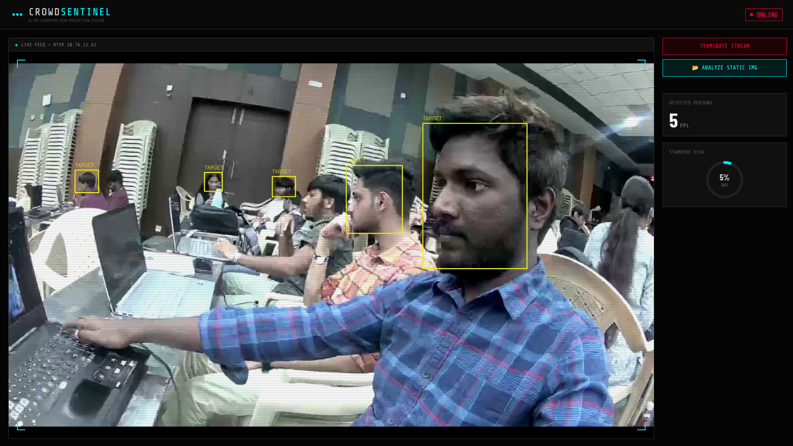

# CrowdSentinel — AI-IoT Stampede Risk Prediction

CrowdSentinel is a high-performance, real-time crowd density monitoring and risk prediction system. It uses computer vision (YOLOv8) to track individuals across live RTSP feeds and provide visual/audible alerts for potential stampede scenarios.



## ◈ Core Features

- **Live AI Detection**: Continuous YOLOv8-powered person detection over RTSP/Webcam.
- **Micro-Zero Lag Feed**: Optimized threading architecture (Capture, AI, Server) to minimize visual latency.
- **Tactical Dashboard**: A high-contrast, industrial dashboard with real-time stats including:
  - **Live Count**: Person count with threshold alerts.
  - **Stampede Risk Gauge**: Integrated risk engine calculating risk percentages.
  - **Crowd Density Gauge**: Visual representation of density across the monitored area.
  - **Timeline Chart**: Historic traffic analysis using Chart.js.
- **Static Analysis**: Capability to upload and analyze images for one-off density checks.

## ◈ Hardware & Edge Device

Crowdsentinel is designed to work with resource-constrained IoT edge devices. The system utilizes the **Realtek Ameba Pro 2 (RTL8735B)** development board integrated with a high-resolution camera module.


- **SoC**: ARM Cortex-M (ARMv8M) up to 300 MHz
- **Memory**: 32–64 MB LPDDR RAM
- **Connectivity**: Dual-band Wi-Fi (802.11ac/n)
- **Multimedia**: Hardware H.264/H.265 video codec & ISP for 5 MP camera input
- **OS**: Amazon FreeRTOS (LTS) for multitasking and secure networking

Real-time video is captured, encoded in H.264, and broadcast using the **Amazon KVS WebRTC C SDK**, allowing for secure, low-latency, peer-to-peer media transmission.

## ◈ Firmware Flashing (`Pro2_PG_tool`)

To flash the firmware onto the Ameba Pro 2, use the provided `Pro2_PG_tool _v1.3.0` located in the root directory.

1.  **Connect Device**: Connect the board to your PC via a USB Micro-B cable.
2.  **Select Tool**:
    - **Windows**: Run `Pro2_PG_tool _v1.3.0/uartfwburn.exe`.
    - **Linux**: Run `Pro2_PG_tool _v1.3.0/uartfwburn.linux`.
3.  **Configure Settings**:
    - Select the correct COM/Serial port.
    - Set the baud rate to **115200**.
4.  **Flash**: Select the target binary (e.g., `flash_ntz.bin`) and begin the burning process via the UART bootloader.

## ◈ AWS Kinesis Video Streams (KVS) WebRTC Setup

The system leverages AWS KVS to negotiate WebRTC connectivity and SDP/ICE signaling between the device (Master) and multiple viewers.

1.  **Create Signaling Channel**: Set up a KVS Signaling Channel in the AWS Console and note its ARN.
2.  **Link Channel to Video Stream**: Link the signaling channel to the video stream to ensure WebRTC ingestion is routed correctly.
3.  **IAM Configuration**: Create an IAM policy allowing the edge device to perform KVS Actions (`DescribeSignalingChannel`, `GetSignalingChannelEndpoint`, etc.).
4.  **Firmware Credentials**: Configure the following in your firmware:
    - `AWS_REGION`
    - `AWS_ACCESS_KEY_ID` & `AWS_SECRET_KEY`
    - `AWS_KVS_CHANNEL_NAME`

## ◈ System Diagnostics & Monitoring

- **Serial Console**: Upon powering the device, monitor progress via the serial console (115200 baud). Success is indicated by logs showing "WIFI initialized," "Signaling Channel Described," and successful WebRTC Master task startup.


- **Media Playback Viewer**: The Kinesis Video Streams console provides a live viewer to verify stream ingestion (typically 1280×720 @ 30 FPS, ~1000 kbps).

## ◈ Tech Stack

- **Backend**: Python 3, Flask, OpenCV
- **AI Engine**: Ultralytics YOLOv8 (v8m model)
- **Frontend**: Vanilla HTML5/CSS3 (Cyberpunk/Tactical theme), JavaScript (ES6+), SSE (Server-Sent Events)
- **Visualization**: Chart.js

## ◈ File Usage & Roles

The project follows a modular structure to separate logic from presentation:

-   **`server.py` (Backend)**: The brain of the application. It handles YOLO inference, RTSP stream ingestion, and provides REST/SSE endpoints for the frontend.
-   **`templates/index.html` (Structure)**: The skeleton of the dashboard. It uses Jinja2 templates to dynamically load assets and provides the layout for the live feed and stats panels.
-   **`static/style.css` (Aesthetics)**: Contains the "Military Tactical" design system. It manages the dark-mode theme, scanline animations, and responsive grid layouts.
-   **`static/main.js` (Logic)**: The frontend controller. It manages:
    -   **SSE Connection**: Constantly listens to `/count_feed` for real-time person counts.
    -   **State Management**: Updates risk percentages, status badges, and the timeline chart dynamically.
    -   **API Interaction**: Controls the starting/stopping of the RTSP stream via fetch requests.

## ◈ Folder Structure

```bash
Yan/
└── src/
    ├── server.py        # Primary backend entry point
    ├── static/          # CSS, JS, and UI assets
    │   ├── style.css    # Premium tactical theme
    │   └── main.js       # Real-time state management
    ├── templates/       # Flask HTML templates
    │   └── index.html    # Core dashboard UI
    ├── models/          # Pre-trained YOLO models
    │   └── best_m.pt    # Custom trained weights
    └── .env             # Environment configuration (RTSP URL, AWS credentials)
```

## ◈ Quick Start

1. **Install Dependencies**:
   ```bash
   pip install flask opencv-python ultralytics numpy python-dotenv
   ```

2. **Configure Environment**:
   Create a `.env` file in the `src/` directory:
   ```env
   RTSP_URL=rtsp://your-camera-ip
   ```

3. **Launch Project**:
   ```bash
   cd src
   python3 server.py
   ```

4. **Access Dashboard**:
   Open [http://localhost:5000](http://localhost:5000) in your modern browser.

*Developed for the Yantra Competition.*
